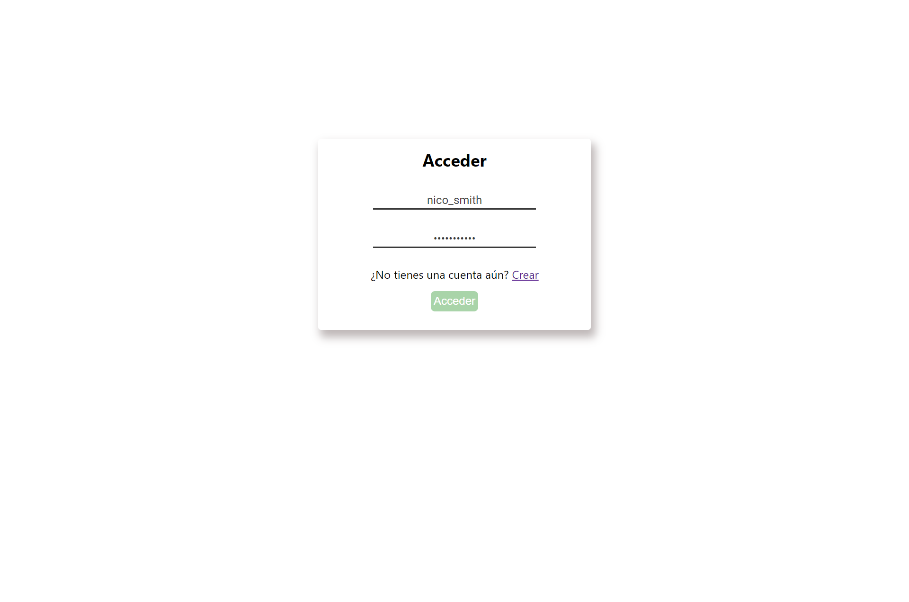
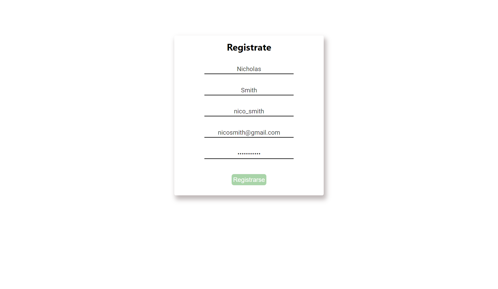
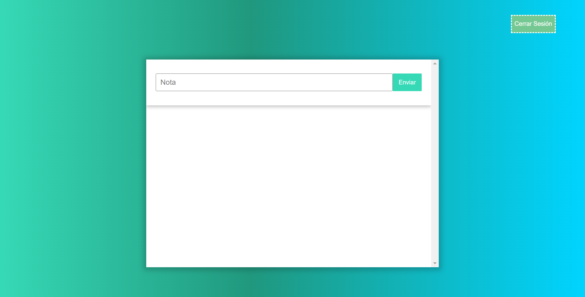
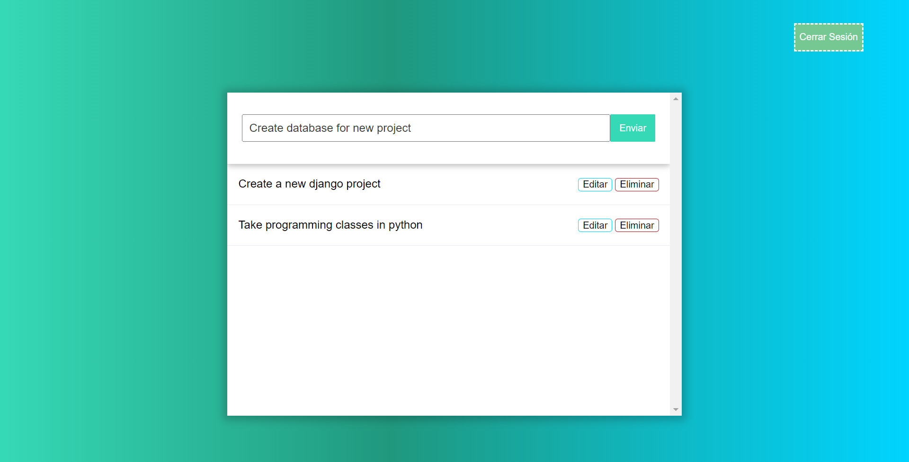
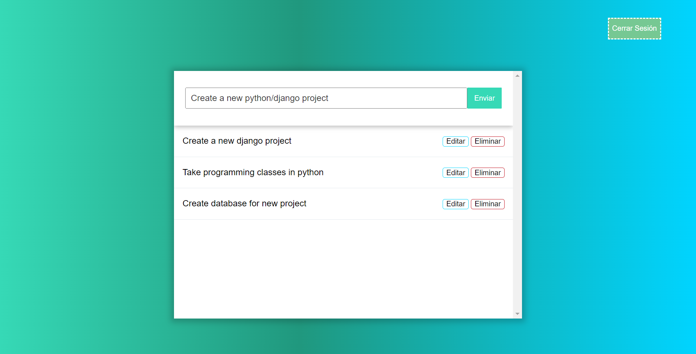
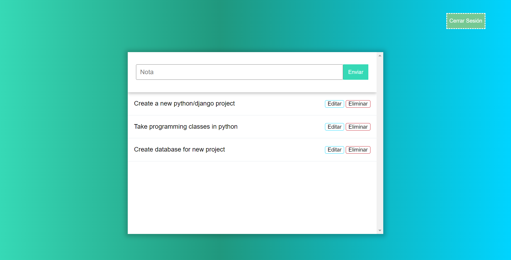
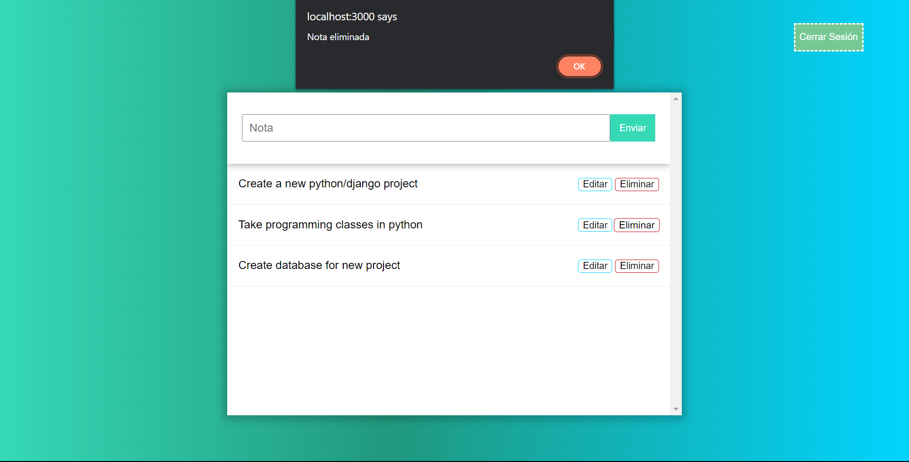
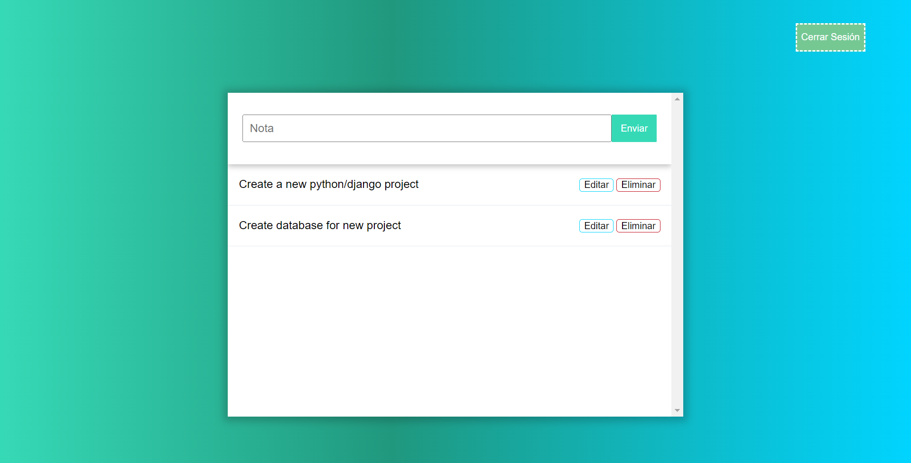

# NotesApp

Note creation application with React and Django, one of the objectives is to develop a system capable of authenticating users with Json Web Token.

### 1. Login

Login page, where users can enter to the application.

### 2. Sign up

Here, users can create an account in the notes app.

### 3. Home

This is the home page where the user has the option to see all the notes or add a new one.

### 4. Add note

In this page a user can add a new note to the list.

### 6. Edit note

When a user press the edit button, the note is displayed in the input where it can be modified.

### 7. Delete note

If a user press the delete button appears an alert informing that it was deleted.

